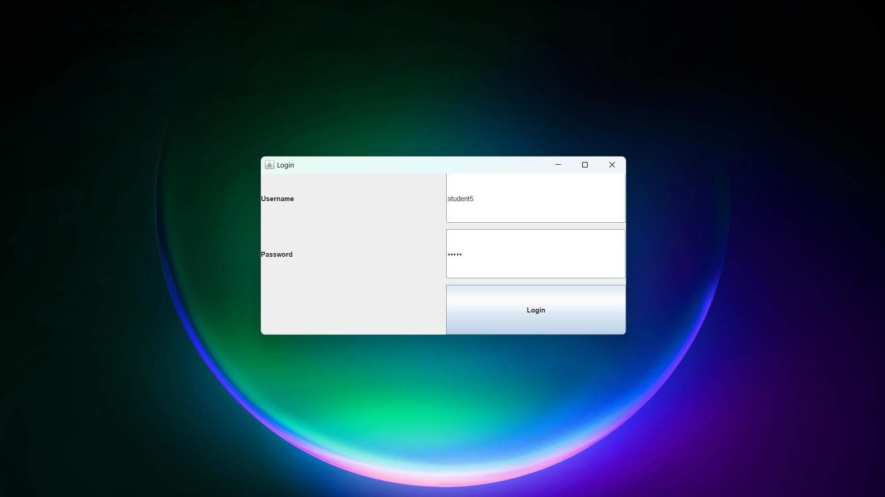
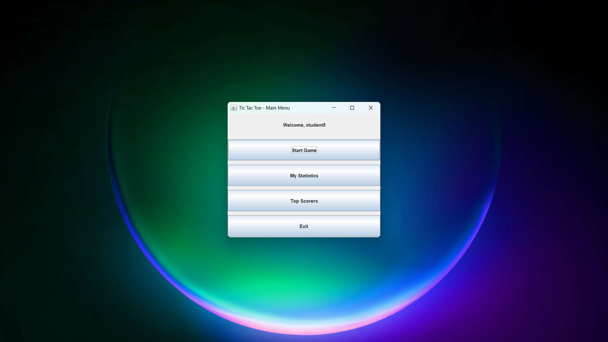
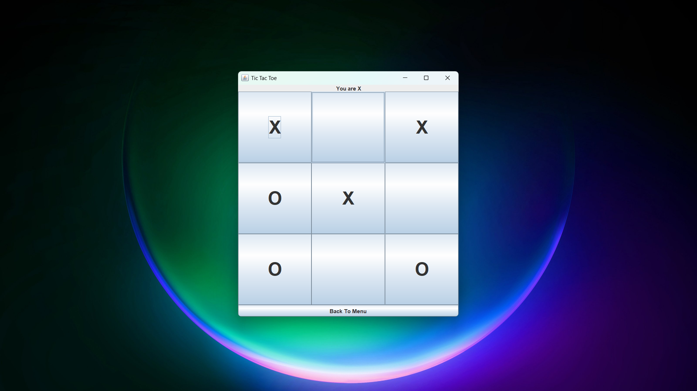
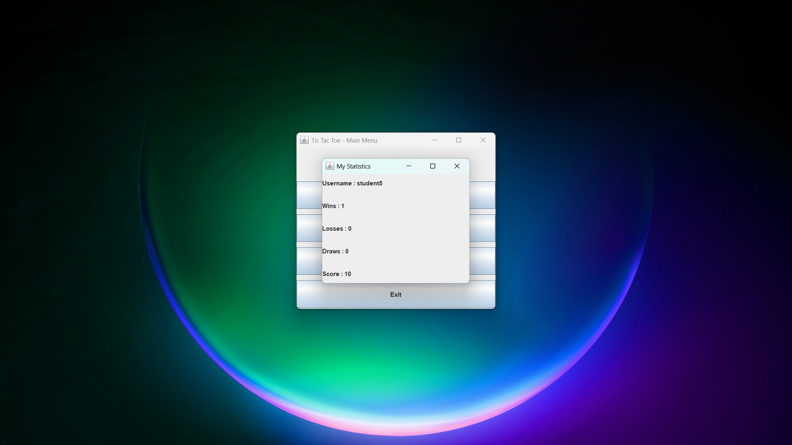
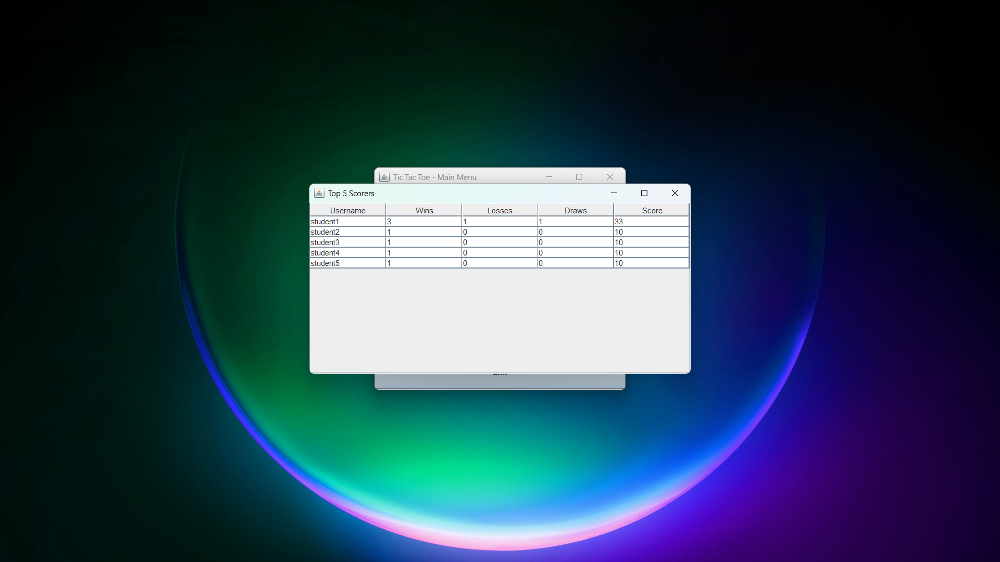

# Simple Tic-Tac-Toe Game with Java Swing, Login, and Statistics

## Student Information

- Name : Muhammad Fauzy Setia Nugraha
- Student ID: 5026251011
- Class : A

## Project Description

This project is a simple Tic-Tac-Toe game built using Java Swing GUI.
The application includes login feature, game statistics tracking, and Top 5 scorer display.

## Features

- Login using database (MySQL)
- Play Tic-Tac-Toe using Swing GUI
- Record wins, losses, draws, and score
- Display personal statistics
- Display Top 5 scorers using JTable

## Score System

| Result | Score |
| ------ | ----- |
| Win    | +10   |
| Draw   | +3    |
| Lose   | +0    |

## Database

- Database used: MySQL
- Table: `players` (one table only)

## How to Run

### 1. Setup Database

- Install MySQL
- Open MySQL or DBeaver and execute: source schema.sql;
- Or simply run all queries contained in schema.sql.

### 2. Configure DatabaseManager

- Open: DatabaseManager.java
- Adjust the database configuration if needed:
  private static final String URL =
  "jdbc:mysql://localhost:3306/game_project";
  private static final String USER = "root";
  private static final String PASSWORD = "";

### 3. Add JDBC Driver

- Download MySQL Connector/J and add it to your project libraries.
- Example: mysql-connector-j-9.x.x.jar

### 4. Run the Program

- Open `src/Main.java` in VSCode
- Click the ▶ Run button at the top right

## Class Explanation

| Class          | Responsibility                                           |
| -------------- | -------------------------------------------------------- |
| Main           | Entry point, opens LoginFrame                            |
| DatabaseManager | Handles MySQL JDBC connection                            |
| Player         | Model class storing player data                          |
| PlayerService  | Login, update statistics, get Top 5                      |
| GameLogic      | Game rules: move validation, winner check, computer move |
| LoginFrame     | Swing window for login                                   |
| MainMenuFrame  | Swing window for main menu                               |
| GameFrame      | Swing window for playing the game                        |
| StatisticsFrame | Swing window for personal statistics                     |
| TopScorerFrame | Swing window showing Top 5 scorers in JTable             |

## Screenshots

### Login Page

### Main Menu

### Gameplay

### Statistics

### Top Scorer

## Video Link

YouTube: https://youtu.be/nGJFPUzdS20

## GitHub Link

GitHub: https://github.com/raspamoryy/FP-tictactoe.git
